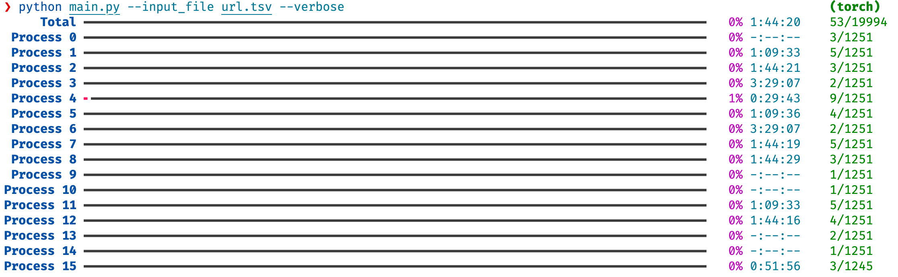

# Install kn_util

```bash
pip install -r requirements.txt
```

# Usage example

```bash
python main.py --input_file url.tsv --verbose
```



# Speed Testing

5000 videos, 16 processes, 32 threads
Note that this is not a strict comparison since video2dataset_mini does not involve post processing of downloaded video.

| Lib                | Times  |
| ------------------ | ------ |
| video2dataset_mini | 7m25s  |
| video2dataset      | 12m25s |
